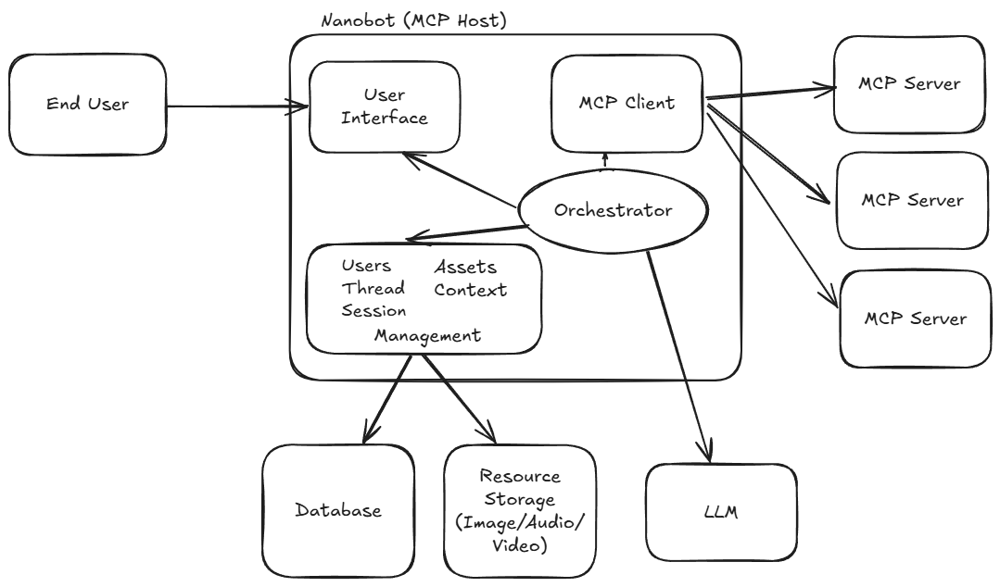

# Nanobot - Build MCP Agents

Nanobot enables building agents with MCP and MCP-UI by providing a flexible MCP host.
While existing applications like VSCode, Claude, Cursor, ChatGPT, and Goose all include an MCP host,
Nanobot is designed to be a standalone, open-source MCP host that can be easily deployed or integrated into
your applications. You can use Nanobot to create your own dedicated MCP and MCP-UI powered chatbot.

## What is an MCP Host?

An [MCP host](https://modelcontextprotocol.io/specification/2025-06-18/architecture/index#host) is
the service that combines MCP servers with an LLM and context to present an agent experience to a
consumer. The primary experience today is a chat interface, but it can be many other interfaces such
as voice, SMS, e-mail, AR/VR, Slack, MCP, or any other interface that can be used to interact with
an agent.



## Examples

Here are some examples of Nanobots in action:
- [Blackjack Game](https://blackjack.nanobot.ai) [(config)](./examples/blackjack.yaml) [(mcp source)](https://github.com/nanobot-ai/blackjack)
- [Hugging Face MCP](https://huggingface.nanobot.ai) [(config)](./examples/huggingface.yaml)
- [Shopping/Shopify](https://shopping.nanobot.ai) [(config)](./examples/shopping.yaml)

## Installation

Nanobot can be installed via [Homebrew](https://brew.sh/):

```bash
brew install nanobot-ai/tap/nanobot
```

This will give you the `nanobot` CLI, which you can use to run and manage your MCP host.

---

## Getting Started

---

## Configuration

Nanobot supports two configuration formats:

1. **Single File Configuration** - A `nanobot.yaml` file
2. **Directory-Based Configuration** - A directory with `.md` agent files

### Single File Configuration

Nanobot supports the following providers:

- **OpenAI** (e.g. `gpt-4`)
- **Anthropic** (e.g. `claude-3`)

To use them, set the corresponding API key:

```bash
# For OpenAI models
export OPENAI_API_KEY=sk-...

# For Anthropic models
export ANTHROPIC_API_KEY=sk-ant-...
```

Nanobot automatically selects the correct provider based on the model specified.

---

Create a configuration file (e.g. `nanobot.yaml`) that defines your agents and MCP servers.

**Example:**

```yaml
agents:
  dealer:
    name: Blackjack Dealer
    model: gpt-4.1
    mcpServers: blackjackmcp

mcpServers:
  blackjackmcp:
    url: https://blackjack.nanobot.ai/mcp
```

Start Nanobot with:

```bash
nanobot run ./nanobot.yaml
```

The UI will be available at [http://localhost:8080](http://localhost:8080).

### Directory-Based Configuration

Instead of using a `nanobot.yaml` file, you can organize your configuration as a directory structure where each agent is defined in its own `.md` file with YAML front-matter.

**Directory Structure:**

```
my-config/
├── agents/              # Agent definitions directory
│   ├── main.md          # Main agent (auto-set as entrypoint)
│   └── helper.md        # Additional agent
└── mcp-servers.yaml     # MCP server definitions
```

**Agent File Format (`agents/main.md`):**

```markdown
---
name: Shopping Assistant
model: claude-3-7-sonnet-latest
mcpServers:
  - store
temperature: 0.7
---

You are a helpful shopping assistant.

Help users find products and answer their questions.
```

The YAML front-matter supports all agent configuration fields (model, name, mcpServers, tools, temperature, etc.), and the markdown body becomes the agent's instructions.

**MCP Servers File (`mcp-servers.yaml` or `mcp-servers.json`):**

```yaml
store:
  url: https://example.com/mcp
  headers:
    Authorization: Bearer ${MY_TOKEN}
```

**Usage:**

```bash
nanobot run ./my-config/
```

**Features:**

- **Agent directory**: All agent `.md` files must be in the `agents/` subdirectory
- **Auto-entrypoint**: If `agents/main.md` exists, it's automatically set as the default agent
- **Agent ID**: Use the `id` field in front-matter, or defaults to the filename (without `.md`)
- **README.md**: Automatically ignored in the `agents/` directory (use it for documentation)

See the [directory-config example](./examples/directory-config/) for a complete working example.

---

## Development & Contribution

Contributions are welcome! Nanobot is still in **alpha**, so expect active development and rapid changes.

### Build from Source

```bash
make
```

### Working on the UI

The Nanobot UI lives in the `./ui` directory. To develop against it:

1. Remove the old build artifacts:

   ```bash
   rm -rf ./ui/dist
   ```

2. Rebuild the Nanobot binary:

   ```bash
   make
   ```

3. Start the UI in development mode:

   ```bash
   cd ui
   npm run dev
   ```

4. The UI must be served from port **5173**.\
   Nanobot runs on port **8080** and will forward UI requests to `:5173`.

---

## Features & Roadmap

Nanobot aims to be a **fully compliant MCP Host** and support all MCP + MCP-UI features.

| Feature Category           | Feature | Status        |
| -------------------------- |---------| ------------- |
| **MCP Core**               | TODO    | ✅ Implemented |
|                            | TODO    | 🚧 Partial    |
|                            | TODO    | ❌ Not yet     |
|                            | TODO    | ✅ Implemented |
| **MCP-UI**                 | TODO    | 🚧 Partial    |
|                            | TODO    | ✅ Implemented |
|                            | TODO    | ❌ Not yet     |

✅ = Implemented 🚧 = Partial / WIP ❌ = Not yet ⏳ = Planned

### Roadmap

- Full MCP + MCP-UI compliance
- More robust multi-agent support
- Production-ready UI
- Expanded model provider support
- Expanded authentication and security features
- Frontend integrations (Slack, SMS, email, embedded web agents)
- Easy embedding into existing apps and websites

---

## License

Nanobot is licensed under the [Apache 2.0 License](LICENSE).

---

## Links

- Website: [nanobot.ai](https://nanobot.ai)
- GitHub: [github.com/nanobot-ai/nanobot](https://github.com/nanobot-ai/nanobot)
